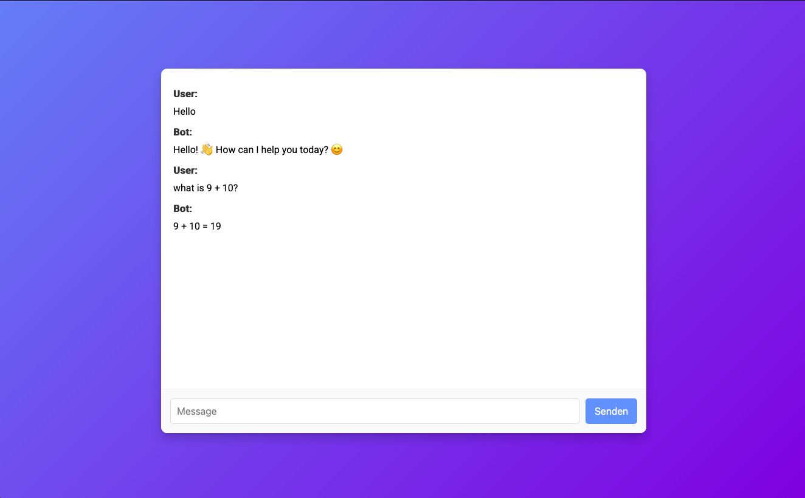

# diy-chatbot
Self host a small language model on a cpu fast and simple.



## Setup

You will need docker on the host system.

Then just simply use the commands provided in *setup.sh*

~~~sh
chmod +x setup.sh
~~~

~~~sh
sudo ./setup.sh
~~~

Visit your Browser on port 80 and start chatting.

## Using different models

For example use deepseek-r1 from huggingface:

run 
~~~sh
docker exec ollama ollama pull hf.co/bartowski/DeepSeek-R1-Distill-Qwen-1.5B-GGUF:Q6_K
~~~

and change the line in [main.py]([http://dev.nodeca.com](https://github.com/azubi3/diy-chatbot/blob/main/app/main.py#L12)) to

```
hf.co/bartowski/DeepSeek-R1-Distill-Qwen-1.5B-GGUF:Q6_K

```
